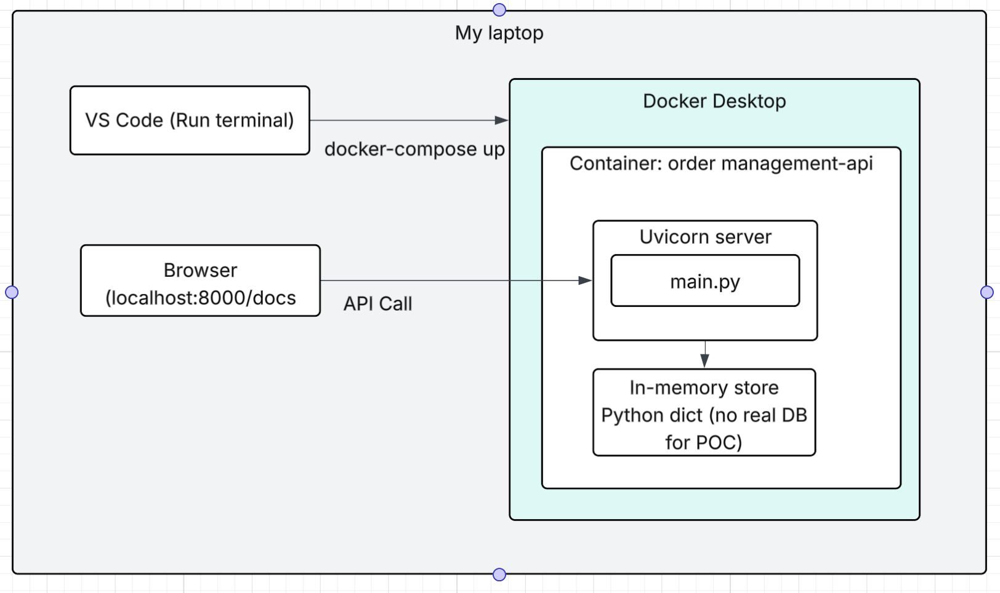

# Order Management Microservice — POC

A lightweight Order Management API built with **Python + FastAPI**, containerized with **Docker**.

Demonstrates API-first microservice design with four core CRUD operations.

---

## Architecture Overview

```
Client / API Consumer
        |
   [ API Gateway ]         ← enforce RBAC, rate limiting, auth here
        |
[ Order Management API ]   ← this service
        |
  [ In-Memory Store ]      ← replace with PostgreSQL / SAP in production
```
## Infrastructure diagram


---

## Quick Start

### 1. Prerequisites
- Docker Desktop installed and running

### 2. Run the service

```bash
docker-compose up --build
```

### 3. Open API Docs (auto-generated)

```
http://localhost:8000/docs
```

---

## API Endpoints

| Operation     | Method | Endpoint               |
|---------------|--------|------------------------|
| Create Order  | POST   | /orders                |
| Query Order   | GET    | /orders/{order_id}     |
| Update Order  | PATCH  | /orders/{order_id}     |
| Cancel Order  | DELETE | /orders/{order_id}     |
| List Orders   | GET    | /orders                |
| Health Check  | GET    | /health                |

---

## Test with curl

### Create Order
```bash
curl -X POST http://localhost:8000/orders \
  -H "Content-Type: application/json" \
  -d '{
    "customer_id": "CUST-001",
    "items": [
      {"product_id": "SKY-RF-5G-001", "quantity": 2, "unit_price": 49.99}
    ]
  }'
```

### Query Order
```bash
curl http://localhost:8000/orders/{order_id}
```

### Update Order
```bash
curl -X PATCH http://localhost:8000/orders/{order_id} \
  -H "Content-Type: application/json" \
  -d '{"status": "CONFIRMED"}'
```

### Cancel Order
```bash
curl -X DELETE http://localhost:8000/orders/{order_id}
```

---

## Order Status Flow

```
PENDING → CONFIRMED → PROCESSING → CANCELLED
```

---

## Production Considerations (beyond POC)

- Replace in-memory store with PostgreSQL or SAP ERP integration
- Add JWT-based authentication at the API Gateway layer
- Implement RBAC — e.g., only ORDER_ADMIN role can cancel orders
- Add event publishing (Kafka/Event Grid) on order state changes
- Add pagination to GET /orders
- Deploy behind an API Gateway (Azure APIM, Kong, AWS API GW)
